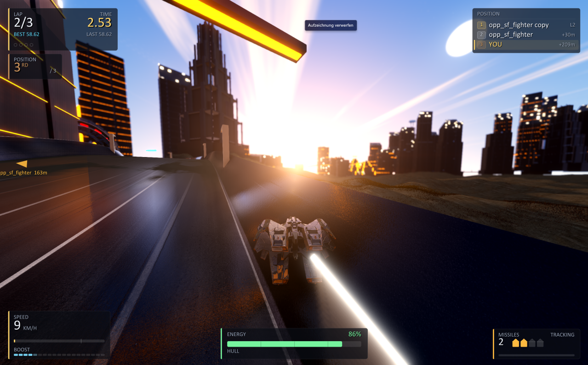
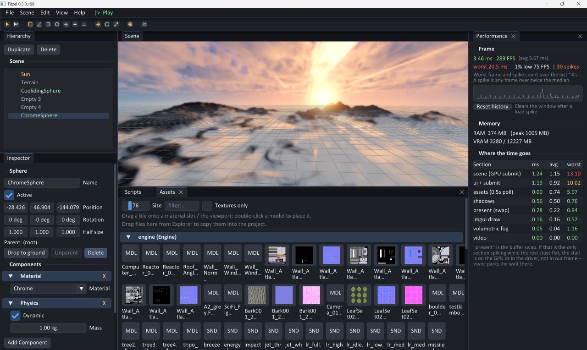
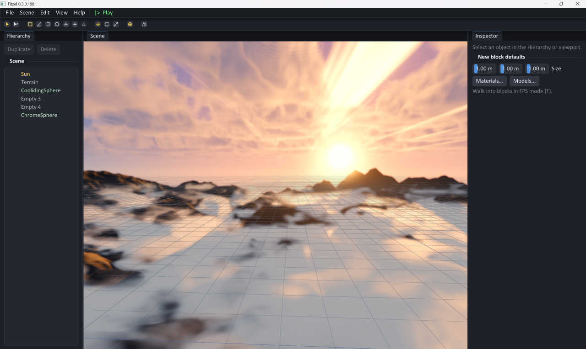
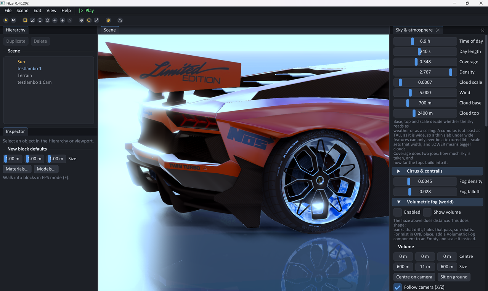
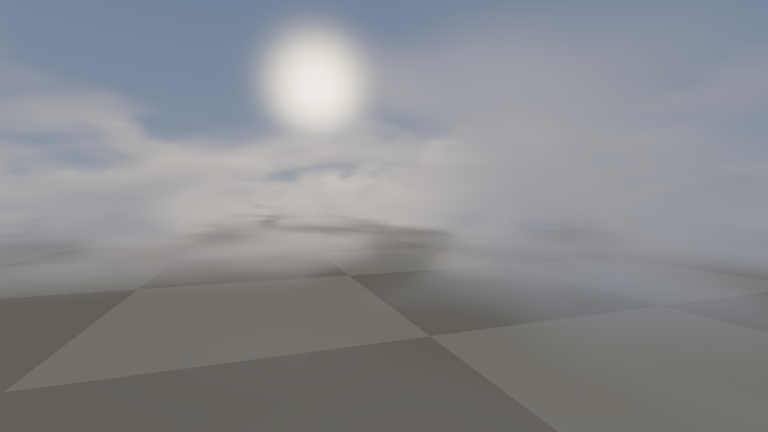
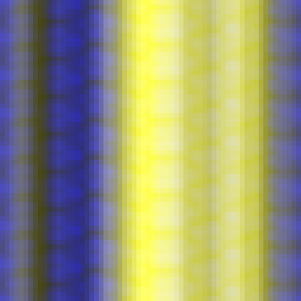
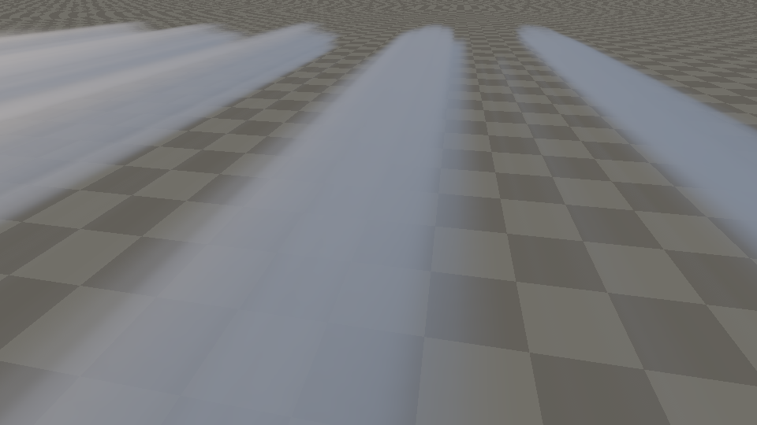
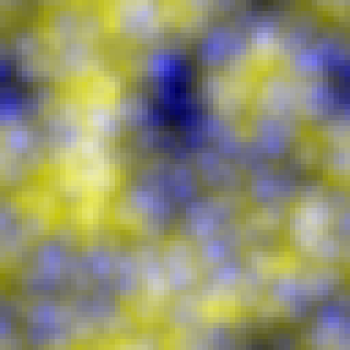
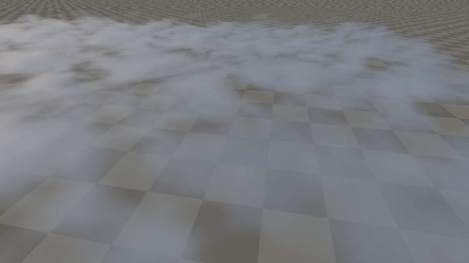

# Fitzel

Fitzel is a game engine with an editor, written in modern C++20 against OpenGL 3.3
core -- Windows, Linux and macOS, with every dependency fetched at configure time and
nothing installed system-wide. You build a world in it (terrain, roads, buildings,
props, lights, scripts), press Play to drive through that world, and export the result
as a standalone game that no longer contains the editor.



What it is pointed at is things that move through a landscape at speed. Roads are
splines laid across streamed procedural terrain, with bridges, tunnels, loops, kerbs
and guard rails *derived* from those splines rather than placed by hand; a district
generator fills the sides with buildings that keep out of the road; and a race sim, a
car, a glider, a HUD, opponents and a leaderboard come with it instead of having to be
written first. Gameplay behaviour is Lua -- one script per entity, on a fresh VM every
time Play starts (see [docs/lua-scripting.md](docs/lua-scripting.md)). The tools
themselves stay C++, deliberately: a broken script must never be able to take an
editing session with it.

The editor has one rule that outranks convention: **nothing important may require a
steady hand.** Every value that can be dragged can also be clicked and typed, a click
that drifts a little is still a click rather than the start of a drag, panels move only
by their title bar, and the double-click window is wider and more forgiving in position
than standard. None of that is a mode -- there is nothing to switch on, no second
workflow to learn and no habit from another editor that stops working; the thresholds
around the ordinary widgets are simply set wider (`engine/src/ui/Gui.cpp`). Where a
tool could only be built around precise dragging, it gets a typed or stepped path
instead, and that constraint wins when it and convention disagree.

## Stack

Everything below is pulled in by `FetchContent` from
[cmake/Dependencies.cmake](cmake/Dependencies.cmake), which is also the file the
licence notices are generated from — so this table and what actually links cannot
drift apart for long.

| Concern              | Library |
| -------------------- | ------- |
| Windowing / input    | [GLFW](https://www.glfw.org/) |
| OpenGL loader        | [GLAD2](https://github.com/Dav1dde/glad) (gl 3.3 core, generated at configure time) |
| Math                 | [GLM](https://github.com/g-truc/glm) |
| Editor UI            | [Dear ImGui](https://github.com/ocornut/imgui) (docking) + [ImGuizmo](https://github.com/CedricGuillemet/ImGuizmo) gizmos + [ImGuiColorTextEdit](https://github.com/BalazsJako/ImGuiColorTextEdit) for the script editor |
| Images               | [stb_image](https://github.com/nothings/stb), [tinyexr](https://github.com/syoyo/tinyexr) for the EXR normal maps and HDRIs |
| Model loading        | [assimp](https://github.com/assimp/assimp), [cgltf](https://github.com/jkuhlmann/cgltf) |
| Audio                | [miniaudio](https://github.com/mackron/miniaudio) |
| Physics              | [Jolt](https://github.com/jrouwe/JoltPhysics) |
| Gameplay scripting   | [Lua](https://www.lua.org/) |
| Scenes / settings    | [nlohmann/json](https://github.com/nlohmann/json) |

Versions live in `cmake/Dependencies.cmake` rather than here, for the same reason.
Nothing is installed system-wide, and **no dependency is copied into this repo**.

The first configure/build therefore needs a network connection, and Python 3 with
Jinja2 (which is what GLAD generates the loader with):

```sh
python -m pip install jinja2
```

## Layout

```
fitzel/
├── CMakeLists.txt          # top-level build
├── CMakePresets.json       # ready-made configure/build presets
├── cmake/Dependencies.cmake# every third-party dependency, and their versions
├── engine/                 # the engine, built as a static lib `fitzel`
│   ├── include/fitzel/     # public API (<fitzel/...>)
│   └── src/                # implementation
└── sandbox/                # editor + player
    ├── src/main.cpp        # streamed infinite terrain + CSM + materials
    ├── assets/shaders/     # GLSL shaders (copied next to the binary)
    └── tools/              # offline checks (see "Offline checks" below)
```

## Build

### With presets (recommended)

```sh
cmake --preset default        # configure (Ninja, Debug)
cmake --build --preset default
./build/default/bin/sandbox   # run (sandbox.exe on Windows)
```

Other presets: `release` (Ninja, optimized) and `vs` (Visual Studio solution).

### Plain CMake

```sh
cmake -S . -B build
cmake --build build
```

On Windows the bundled CMake/Ninja/compiler ship with Visual Studio — run the
commands from a *Developer PowerShell for VS* so the toolchain is on `PATH`.

## Extending the engine

The engine exposes a small, RAII-based core to build on:

- `fitzel::Window`  — GLFW window + OpenGL 3.3 context, frame loop helpers.
- `fitzel::Input`   — per-frame keyboard/mouse polling, mouse delta, cursor lock.
- `fitzel::Shader`  — compile/link GLSL, set uniforms (incl. GLM types).
- `fitzel::Mesh`    — VAO/VBO/EBO wrapper with interleaved `Vertex` data; `Mesh::cube()`.
- `fitzel::Texture` — 2D textures from file (stb), raw pixels, or a checkerboard.
- `fitzel::Camera`  — first-person fly camera producing view/projection matrices.
- `fitzel::Material` — a `Shader` plus named uniform/texture parameters (`apply()`).
- `fitzel::Renderer` — forward renderer driving cascaded shadows + a lit pass over
  submitted `(mesh, material, model)` tuples, with per-pass frustum culling.
- `fitzel::CascadedShadowMap` — frustum-split directional shadows in a depth array.
- `fitzel::ShadowMap` — single-cascade depth FBO (simpler alternative to CSM).
- `fitzel::RenderTarget` — off-screen color+depth FBO for render-to-texture passes.
- `fitzel::Terrain` — `TerrainStreamer` streams an infinite, seamless fBm terrain
  as `TerrainChunk`s around the camera; `terrainHeight()` queries the field.
- `fitzel::Gui`     — Dear ImGui context + GLFW/OpenGL3 backends; call ImGui:: directly.
- `fitzel::Audio` / `fitzel::Sound` — miniaudio-backed playback: looping ambient
  layers (volume-controlled) and one-shot effects, used to drive weather audio.

`sandbox/` is what ties it together, and it builds twice from mostly the same sources:
`sandbox.exe` is the editor, `player.exe` is the same world without any of the tooling
— which is the copy "Export Game" ships. What the two share is the *runtime*
(terrain, roads, vehicles, scripts, audio, the whole render path); what only the editor
has is the panels, the gizmos and the undo stack.

The scene both of them draw is an **infinite, streamed procedural landscape** under a
**day/night sky with volumetric clouds**, lit by a directional sun with **cascaded
shadow mapping** (PCF), **atmospheric fog** (aerial perspective), **raymarched
volumetric fog** in placed volumes, and a **planar-reflective water plane** flooding
the valleys. The renderer exposes both a one-call path
(`begin()` → `submit()` → `end()`) and multi-pass building blocks
(`prepareShadows()` + `renderScene(view, proj, eye, clipPlane)`), which is what the
reflection and refraction passes are built out of.

Editor camera: WASD + Q/E to move, hold right mouse to look, scroll to zoom. `F` frames
the selected object; `Shift+F` toggles walking through the scene in first person.



### Rendering notes

- **Colour management & post**: the scene renders linear into an HDR (RGBA16F)
  buffer; a composite pass adds **bloom**, **god rays** (radial march from the sun's
  screen position) and an analytic **lens flare**, then applies **ACES filmic
  tonemapping** + exposure + gamma. Authored sRGB colours are linearised on use and
  the sun is an HDR radiance, so highlights bloom and the sun reads as a sun.
- **Terrain texturing**: four PBR sets (sand / rocky ground / cliff / snow) are
  **triplanar-mapped** (projected on the three world axes, blended by the normal) so
  steep faces don't stretch, and blended by height + slope. Each contributes an albedo
  *and a normal map* (triplanar Whiteout blend) for surface relief. EXR images load via
  **tinyexr**. Beyond the automatic blend, a **paint brush** hand-paints any of the
  first four layers onto the ground — stored as per-vertex weights baked into the
  terrain mesh, overriding the height/slope rule only where painted.
- **Water**: planar reflection/refraction (rendered at half-res, distortion hides it)
  with multi-octave animated normals, **Schlick Fresnel**, depth-tinted refraction and
  a sharp HDR sun glint that the bloom picks up. The refraction pass keeps a depth
  texture, so the water knows its column thickness: thin water at the shore gets
  animated **foam**, and submerged terrain is darkened as **wet** in `lit.frag`.
- **SSAO**: the HDR pass writes a depth texture; a half-res screen-space ambient
  occlusion pass reconstructs view position/normal from depth and samples a hemisphere
  kernel; the composite multiplies it into the scene to darken creases and valleys.
- **Weather**: a single `weather` value (0 clear → 1 storm), drifting automatically or
  driven by a slider, ties together cloud coverage/density/wind/altitude, sun & ambient
  dimming, fog density, Gerstner wave height/choppiness, lightning flashes, and rain.
- **Waves & rain**: the water is a tessellated grid displaced by summed **Gerstner
  waves** (with analytic normals and crest-driven whitecaps/foam that's lit, not flat
  white). **Rain** is a box of falling line streaks that follows the camera, wind-slanted
  and depth-tested against the scene.
- **Weather audio**: looping rain / wind / breeze layers whose volumes cross-fade with
  the weather value, plus a thunder one-shot fired on each lightning flash (via
  `fitzel::Audio`/miniaudio). Placeholder WAVs are git-ignored; generate them with the
  snippet below or drop in your own.

### Weather sounds (not in the repo)

The weather audio loads `rain.wav`, `wind.wav`, `breeze.wav`, `thunder.wav` from a
git-ignored `sounds/` folder (path injected as `FITZEL_SOUND_DIR`). Drop in your own,
or generate procedural placeholders with Python (numpy):

```python
import numpy as np, wave
sr = 44100
def save(name, x):
    w = wave.open(f"sounds/{name}", "w"); w.setnchannels(1); w.setsampwidth(2)
    w.setframerate(sr); w.writeframes((np.clip(x,-1,1)*32767).astype(np.int16).tobytes())
rng = np.random.default_rng(7)
save("rain.wav",  rng.standard_normal(sr*5) * 0.3)               # hiss
save("wind.wav",  np.cumsum(rng.standard_normal(sr*7)) / sr * 4) # low rumble
save("breeze.wav",rng.standard_normal(sr*6) * 0.1)
t = np.arange(sr*4)/sr
save("thunder.wav", rng.standard_normal(sr*4) * np.exp(-t/1.2))  # decaying crack
```
- On laptops the app exports `NvOptimusEnablement` so it runs on the discrete GPU.

### Terrain textures (not in the repo)

The terrain textures are large and **git-ignored**. Drop these 4K sets from
[Poly Haven](https://polyhaven.com/textures) into `textures/`: `coast_sand_01`,
`aerial_rocks_01`, `rocky_terrain_02`, `snow_02` — the `*_diff_4k.jpg` (albedo) and a
`*_nor_gl_4k.png` (OpenGL normal map) for each. CMake injects the folder path at build
time (`FITZEL_TEXTURE_DIR`).

Poly Haven ships the normal maps as **DWAA-compressed EXR**, which most loaders can't
decode. Convert them to PNG once (any tool); e.g. with Python:

```python
import imageio.v2 as iio, numpy as np
for n in ["coast_sand_01","aerial_rocks_01","rocky_terrain_02","snow_02"]:
    img = np.clip(iio.imread(f"textures/{n}_nor_gl_4k.exr")[:, :, :3], 0, 1)
    iio.imwrite(f"textures/{n}_nor_gl_4k.png", (img*255+0.5).astype(np.uint8))
```

- **Cascaded shadows**: the camera frustum is split into 4 depth ranges (practical
  log/uniform blend); each cascade is fit to its sub-frustum and rendered into a
  layer of a 2048² depth `GL_TEXTURE_2D_ARRAY`. The lit pass selects a cascade by
  view-space depth and samples it with a 3×3 PCF kernel + slope/cascade-scaled bias.
- **Terrain streaming**: chunks are generated from world-space noise, so neighbours
  tile seamlessly (shared edges sample the same continuous field, incl. normals).
  Generation runs on a **worker-thread pool** (CPU `MeshData` only); the render
  thread uploads a few finished chunks per frame, so crossing chunk borders never
  stalls the frame. A generation counter discards work made stale by a rebuild.
- **Frustum culling**: each pass extracts its 6 frustum planes (Gribb-Hartmann) and
  tests every submittable's world AABB, so the reflection/refraction/main passes each
  cull against their own frustum. The ImGui panel reports visible vs culled draws.
- **Adjustable view distance**: a single control sets the streaming radius (how many
  chunk rings load) and the camera far plane together, so the cascades and clip range
  follow the visible range.
- **Terrain detail & variety**: domain warping (organic, non-grid shapes) plus
  large-scale **continent** (lowland basins / highlands), **roughness** (plains vs
  rugged mountains) and **plateau** control maps, with a rolling fBm base and a
  ridged-multifractal mountain layer raised only on rugged highlands — so different
  regions and seeds give genuinely different landscapes.
- **Terrain editor**: live ImGui tooling to shape the world. One-click landscape
  **presets** (rolling hills, alpine, canyon, mesa, archipelago, fjords) and epic-scale
  generator knobs — **valley carving**, **peak sharpness**, **relief exaggeration** —
  with a **live preview** that rebuilds on slider release. A 3D **sculpt brush** edits a
  sparse world-space height layer sampled on top of the noise: raise / lower / smooth /
  flatten / **thermal erosion** / landform **stamp** (dome, cone, mesa, crater, ridge,
  **mountain range**) / **carve** (drag a valley, Alt piles a ridge). And a **texture
  paint** brush over the automatic material blend. Sculpt edits and paint persist with
  the scene and re-drape the streamed chunks in-place without stalling the frame.
- **Terrain colour** is procedural (sand → grass → rock → snow) by world height and
  slope — steep faces turn to rock, snow only settles on flat high ground.
- **Sky & day/night**: a fullscreen pass reconstructs the world view ray per pixel
  and shades a sun-driven sky gradient. The time of day rotates the sun, which drives
  the light direction, colour (warm at the horizon) and ambient — and the whole scene
  darkens into night. The same pass also feeds the water reflection (it runs with the
  mirrored view), so clouds reflect on the water.
- **Volumetric clouds**: the sky pass raymarches a cloud slab (3D value-noise fBm
  density with a height falloff), with a secondary light-march toward the sun for
  self-shadowing and a Henyey-Greenstein phase for the silver lining.
- **Atmospheric fog**: exponential height fog + aerial perspective applied in
  `lit.frag`/`water.frag`. Distant geometry fades into a horizon haze whose colour
  tracks the time of day (and warms toward the sun via in-scatter), giving depth and
  hiding the streaming edge; valleys and water pick up ground mist.
- **Volumetric fog**: the other kind, and deliberately a separate thing from the
  bullet above. That one is a closed form -- cheap, global, and with no shape: every
  surface at the same distance gets the same amount of it, nothing can be foggier than
  its neighbour, and the sun cannot be blocked on the way in. This one is a *box* of
  participating medium, raymarched front to back against the scene depth, with its
  density taken from an animated 3D noise field and the sun sampled through the same
  cascades the surfaces use -- which buys the two things the closed form can never
  have: structure (banks, wisps, holes drifting through) and shafts. A short secondary
  march toward the sun shadows the inside of a bank against its lit rim; without it an
  evenly lit volume reads as coloured glass.

  

  Volumes are things you *place*: a `VolumetricFogComponent` on any entity, scaled with
  the gizmo, so the box outlined when it is selected is the box that gets marched. One
  scene-wide volume in the sky settings is one more entry in the same list, for mist
  over a whole track -- it can follow the camera, because a four-kilometre box marched
  in forty steps is a step every hundred metres and the structure disappears between
  them. Volumes accumulate back to front into one buffer, so two overlapping banks read
  as one body of air rather than as whichever was drawn last. Each is drawn as its own
  proxy box rather than a fullscreen pass, which is what makes mist-per-archway
  affordable: a volume covering a tenth of the screen costs a tenth of the fill. The
  buffer runs at a fraction of the pane and is tent-filtered on the way back up.

  Two knobs are worth knowing about because they are not the obvious thing:
  **Vertical detail** squashes the noise lookup vertically. The field is addressed in
  world metres and is isotropic, so at the default scale one feature is a hundred
  metres across on *every* axis -- a forty-metre ground layer then spans two dozen
  features sideways and less than half a feature top to bottom, and reads as a flat
  pattern pulled upward. **Height falloff** raises the coverage *threshold* with height
  instead of scaling the density down. Scaling thins every column by the same curve, so
  the lid of the layer ends up an analytic surface, identical over a bank and over a
  hole; as a threshold the top is a contour of the noise -- ragged, and higher over a
  bank than over a hole.
- **Water**: planar reflection + refraction. The scene is rendered twice off-screen
  (a mirror-matrix camera with the underwater half clipped for the reflection, the
  above-water half clipped for the refraction), then the water surface blends the two
  by Fresnel, with animated noise ripples distorting the projective lookups and a
  specular sun glint. A world-space clip plane (`uClipPlane` in `lit.vert`,
  `GL_CLIP_DISTANCE0`) drives the clipping.

### Multishot camera

A camera that *shoots* an object rather than riding one. It cuts between the moves a
car advert or a replay is made of -- a hero three-quarter, a turntable orbit, a crane
down, a slider past, a push-in, a reveal, a **dolly zoom**, a bird's eye, a wheel-level
pass, a car-to-car track, a nose shot, a **fly-by** with the camera planted in the road,
an overtake -- around whatever it is pointed at. Right-click an object in the hierarchy,
pick **"Shoot this"**, and there is a working camera on it; **Preview** runs the
sequence in the viewport without entering Play.



It is not a camera path, and the difference is the point. A recorded path is a spline of
*world* keyframes, which is right for a fixed subject and useless for a car: drive
somewhere else and the whole path has to be authored again. Every move here is expressed
relative to the subject instead -- "three quarters front, one car length out, drifting
in" -- so it holds for any object, anywhere, at any speed. It is also why the subject is
*named* (an entity id) rather than read off the hierarchy as the follow camera's is: a
camera that films a car stands beside it, ahead of it, or waits for it at the kerb, and
as a child of that car every shot would be fighting its transform.

What keeps it from being a shuffle of angles:

- **Every distance is a multiple of the subject's bounding box**, never metres, so the
  same settings frame a go-kart and an articulated lorry.
- **The shot list follows the subject's measured speed.** A fly-by needs something to
  fly by: below a crawl it is a camera watching a parked car, so it is weighted out and
  the standing moves come in; past motorway speed it is the other way round.
- **The eye stays out of the ground**, checked against the terrain every frame. The
  shots that live near the tarmac are the good ones and the ones that would otherwise
  end up inside a hill.
- **No shot twice in a row, alternating flanks, shot lengths that vary.** Two orbits
  back to back do not read as two shots, and cuts landing on an exact metronome are the
  clearest tell that a sequence was generated rather than cut.
- **A seed is a take**: the same seed replays the same run, so a sequence can be shot
  again after moving a light.

Mechanically it is one more mode of the existing Camera component
(`sandbox/src/MultiShot.hpp`), so it resolves to the same pose every other camera does --
and works unchanged as the Play camera, as a CameraSwitcher target, in a script, in
split screen and in the exported player.

### Offline checks

Several things here cannot be judged from inside the editor, and each has a small
console program that renders or measures it on its own. They are built alongside the
game and run by hand; none of them ship.

| Tool | What it answers |
| ---- | --------------- |
| `shadercheck <shaders>` | Does every shader still compile? A broken one costs its effect *silently* -- the Release editor is `/SUBSYSTEM:WINDOWS` and has nowhere to print a compile error to. Exits non-zero. |
| `skycheck <out> <shaders>` | What does the sky actually look like? Renders `sky.frag` alone, from cameras pointed where the clouds are. |
| `fogcheck <out> <shaders>` | What does the volumetric fog actually look like -- and what is in the field it is made of? |
| `shotcheck` | Does the multishot camera keep its subject in frame and its eye out of the ground -- over a parked car, a fast one, a lorry and a slope? This is the one fault you cannot see in the editor, because the editor shows you the picture from *inside* the mistake. Exits non-zero. |
| `citycheck` | Does any generated building overhang the kerb? A tower over the road is a wall you hit at speed on a stretch that looked clear. Exits non-zero. |
| `iconcheck [png] [exe]` | Will Windows really use the icon "Export Game" wrote into the exe? Exits non-zero. |
| `audiocheck <wav>` | Does the device give the engine more than one output channel? A mono output is the likeliest reason for a world with no direction in it. |

`skycheck` and `fogcheck` are not tests -- nothing in them passes or fails. They are a
way of *seeing*: the sky sits behind the panels and above the default pitch, and the
fog is half-resolution, tent-blurred, under bloom and a tonemapper and only visible
from inside the volume, so both had previously been worked on by reasoning about noise
functions and hoping.

`fogcheck` marches `volfog.frag` at full resolution against a synthetic depth buffer --
no half-res, no upsample, no post -- so what comes out is the field rather than the
filter, and a bank can be judged without a scene arguing about it:



It also writes three orthogonal slices of the baked 3D noise straight out, and that
dump is the part that earns the tool. The fog once had no vertical structure at all,
and from the shader's side nothing disagreed with anything: every band, every octave
and the worley lattice share one cell hash, and that hash (FNV-1a with no finalizer)
avalanches *upward*, so whichever coordinate is mixed last never reaches the low bits
`hashUnit` reads. The 64³ volume was a 2D field extruded along one axis, and a
horizontal slice of it said so in one look:

| Horizontal slice of the field | The layer it produced |
| ----------------------------- | --------------------- |
|  |  |
|  |  |

```sh
build/release/bin/fogcheck out sandbox/assets/shaders   # fogcheck.exe on Windows
```

Add new subsystems under `engine/src/` and their headers under
`engine/include/fitzel/`, then list the sources in `engine/CMakeLists.txt`.
Natural next steps: triplanar terrain texturing with real albedo maps, a
material/texture asset system, model loading (glTF/OBJ), and a scene graph.

## Shipping a game

"Export Game" writes a folder that runs: the editor-free `player.exe` under the
game's own name, a boot `game.json`, the licence notices, and -- unless the
switch is turned off -- one encrypted `game.fpak` holding the content instead of
browsable folders. What that folder is called, which scenes it carries and what
the loading screen looks like all come from **Game Settings**, stored per project
in `game.json` next to the scenes.

**Start as** is there too, next to the start scene, because the two are one
decision: which level opens, and what the player is when it does -- on foot at
the Player Start, behind the wheel of the scene's vehicle, flying its glider, or
watching, through the camera marked Main Camera or through the multishot camera
that cuts its own shots. The last two are how a game opens on an attract screen
rather than on a player. A mode the scene cannot provide falls back to on foot:
a game that cannot start the way it was configured should still start.

Two of those settings are about the thing somebody actually receives:

- **Icon** -- a square PNG. The export scales it to every size Windows asks for
  (16 to 256), builds the icon in memory and writes it straight into the copied
  exe's resources with `UpdateResource`. There is no `.ico` to make and no
  rebuild of the engine: the exe being branded was linked long before, which is
  the whole reason it is done this way. See `sandbox/src/IconEmbed.cpp`.
- **Installer** -- generates an [Inno Setup](https://www.innosetup.com) script
  for the finished folder and compiles it into a single `<name>-setup.exe`
  beside it, with the same icon, a Start-menu entry and an uninstaller. It
  installs per-user (`PrivilegesRequired=lowest`), so nobody is asked for admin
  rights to play a game.

  Inno Setup is a separate free install and is looked up on the machine -- the
  Game Settings dialog says up front whether it found one. Without it the export
  still succeeds; only the setup is skipped, and the status line says so. The
  generated script is kept in `%TEMP%\fitzel-installer\setup.iss` if a failed
  compile needs reading.

Both steps are deliberately unable to fail an export: an unbranded exe in a
working folder beats throwing away a ten-minute export over a picture.

## Licences

Every third-party component the engine links is permissive -- MIT, BSD-3-Clause,
zlib, Boost or MIT-0 -- so a game built with it can be closed-source and sold,
and nothing here places a condition on your own code. What those licences DO
require is that their copyright notices travel with the binary, which is what
[docs/third-party-licenses.md](docs/third-party-licenses.md) is for: the editor
build drops it next to the executable and "Export Game" copies it into the
exported folder.

That file is generated, never typed -- versions are read back out of
`cmake/Dependencies.cmake` and every licence text is copied verbatim from the
fetched sources, so it cannot drift away from what is actually built:

```
python tools/collect-licenses.py
```

Re-run it after bumping a dependency; it refuses to write a file for a
dependency it has never been told about.

The art, audio and models a game is made of are a separate question with a
separate answer, and this file says nothing about them. FFmpeg is not linked and
not shipped: the video importer runs whatever `ffmpeg` the machine has (see
`VideoImport.cpp`), which keeps its LGPL/GPL terms out of both the engine and
the exported game.
